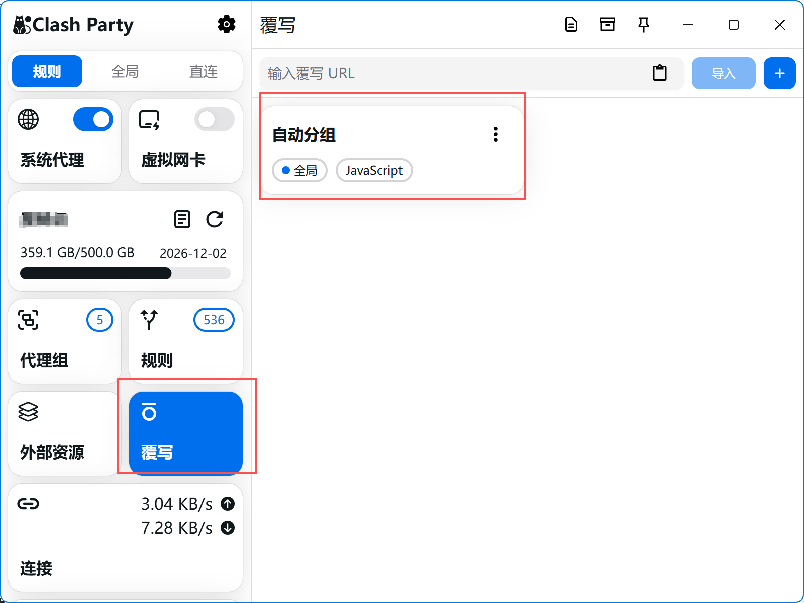
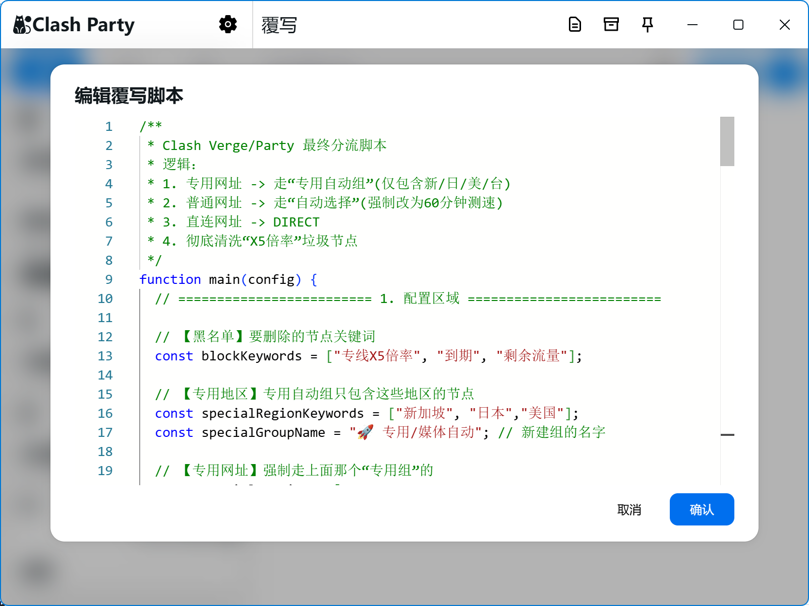
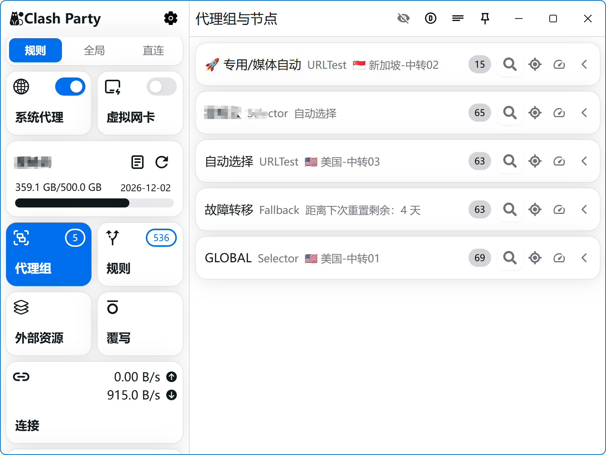

# 🚀 Clash Verge/Party 智能分流与优化脚本

一个专为 **Clash Verge** 和 **Clash Party** 设计的配置覆写脚本 (Overwrite Script)。

它能帮你自动清洗垃圾节点、优化测速频率（省流）、并为 ChatGPT、Netflix 等服务建立专用的高速通道。

## ✨ 核心功能

1.  **🧹 节点彻底清洗**：自动移除包含“到期”、“剩余流量”、“官网”、“X5倍率”等关键词的垃圾节点，让你的列表清爽干净。
2.  **🤖 专用智能分组**：自动筛选 **美国/日本/新加坡/台湾/香港** 等优质节点，新建一个 **`🚀 专用/媒体自动`** 策略组。
3.  **⚡️ AI 与流媒体加速**：强制 ChatGPT、Netflix、YouTube、Spotify 等服务走上面的“专用组”，防止被分配到慢速节点。
4.  **📉 自动测速优化**：将机场默认的“自动选择”测速间隔从 5分钟 强制改为 **60分钟**。
    *   *好处：大幅减少后台偷跑流量，降低机场封号风险，同时减少节点列表跳动。*
5.  **🛡 直连白名单**：内置常用国内网站（淘宝、京东、百度等）强制直连规则，避免国内 App 误走代理变慢。

---

## 📖 使用教程

### 适用软件
- **Clash Verge (Rev)**
- **Clash Party**
- *任何支持 JavaScript 覆写 (Script/Merge) 功能的 Clash 客户端*

### 步骤图解

1.  **复制脚本代码**：
    打开本仓库的 `smart-split.js` 文件，或者 [点击这里复制完整代码](#)。

2.  **新建脚本**：
    *   打开 Clash Verge/Party 客户端。
    *   点击左侧菜单的 **Script (脚本)** 或 **Profiles (配置)** -> **Merge/Script**。
    *   点击 **New (新建)**，类型选择 `Script` (JavaScript)。
    *   名称随意填写，例如：`智能分流优化`。





3.  **粘贴与保存**：
    *   将刚刚复制的代码粘贴到编辑框中，**完全覆盖**原本的内容。
    *   点击保存 (Save)。

4.  **启用脚本**：
    *   回到 **Profiles (配置)** 界面。
    *   右键点击你正在使用的订阅文件 -> 选择 **Edit Script (编辑脚本/应用脚本)**。
    *   勾选你刚才创建的 `智能分流优化`。
    *   点击保存图标。

5.  **大功告成**：
    *   回到 **Proxies (代理)** 界面，点击右上角的刷新图标。
    *   你会发现多了一个 `🚀 专用/媒体自动` 组，且节点列表变干净了！

---

## ⚙️ 自定义配置 (可选)

如果你懂一点点代码，可以在脚本最上方的 `UserConfig` 区域进行个性化修改：

```javascript
const UserConfig = {
  // 想删除更多垃圾节点？在这里加词
  blockKeywords: ["专线X5倍率", "到期", "剩余流量", "我的自定义垃圾词"],

  // 想让专用组包含更多国家？在这里加
  specialRegionKeywords: ["新加坡", "日本", "美国", "韩国"],
  
  // 有网站不想走代理？加在这里
  directDomains: ["baidu.com", "你的公司内网.com"],

  // ...
};